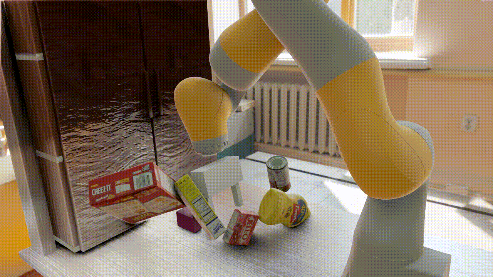

Remote-Operated Blender
-----------------------


Provides:
- Some convenient abstractions for setting up simple scenes
of textured meshes:
   - `blender_scripts/blender_scene_management.py` provides
   the highest-level abstractions, and builds (in a handful of
   places) on the other scripts in that folder (provided by
   Wei Gao, possibly adapted from elsewhere? not sure of their
   history yet). They can be invoked from Blender python scripts
   directly, presuming you have done the small amount of required
   Blender customization (see below). 
- A very simple ZMQ-based server for remotely operating that
highest-level abstraction. It provides a simple interface for
telling the Blender server to call any of those high-level
functions with arbitrary serializable arguments. It also has
a special command for getting an image back (currently a serialized
jpeg).


## Usage + Examples

- Using the abstraction layer itself from Blender: launch `render_main_bsm.py` with Blender, using e.g. `run_example_bsh.sh`.
- Using the Blender server: launch the Blender server with blender, using e.g. `run_blender_server.sh`. Then run `test_blender_server.py` with any Python that has `zmq`, `numpy`, and `imageio`.	
- Using the lower-level utilities: launch `render_main_manual.py` with Blender, using e.g. `run_example_manual.sh`.


## Setup

This requires Blender >= 2.8 (to use the nice Eevee renderer), and has only
been tested on Ubuntu 16.04. It probably works on 18.04, it probably works
on Mac, it might work on Windows... but that's not tested yet.

I recommend downloading Blender from [their website](https://www.blender.org/)
and installing it locally. (I put it in `~/tools/blender-2.80`.) Make
an environment variable named `BLENDER_PATH` that points to the blender
executable by putting this at the end of your `~/.bashrc` (or do something
equivalent):

```
export BLENDER_PATH=/home/gizatt/tools/blender-2.80/blender
```

I don't have a pleasant way of doing this yet, but you'll need to get the
`zmq` and `attrs` libraries working in Blender. I'll try to make this easier /
document how to do this in the future, but how I did it was approximately:

1) Make a conda environment with Python 3.7.
2) conda install attrs && pip install zmq
3) Copy "attr*" (not "attrs*"!) and "zmq*" and "pyzmq*" from the environment's `site-packages` folder to `blender-2.80/2.80/python/lib/python3.7/site-packages/`.
4) Copy "libsodium*" and "libzmq*" from the environment's `lib` folder to `blender-2.80/2.80/python/lib`. This was necessary, I think, because I had other versions of those libraries in my system somewhere that were conflicting, so I needed to give Blender the right version with higher priority.


## Schematic Flow for Rendering a Simple Scene

1) Client registers environment map with a filename attribute.
2) Client registers each material with identifying name and texture path(s) or
colors.
3) Client registers each object under a unique identifying name, with optional
parameters for location, quaternion rotation, material (by identifying name).
4) Client registers extra lights under unique names.
5) Client registers camera under a unique name with its focal length, fov, etc.

While True:

6) Client requests a frame from that camera's unique name.
7) Client updates camera location, object location, etc...


## TODOs / Ideas for neat features

### Immediate
- Light management isn't exposed.
- Camera FOV, focal length, other parameters probably not exposed.
- Textures are reasonable reusable between objects, I think, but objects
themselves are reloaded pretty liberally. Can I fix that?
- Images get saved out to disk + then reloaded for serialization back
to the client. This is really inefficient (hundreds of ms for big ones).
Getting images directly from Blender in background mode is tricky, though --
the standard trick of rigging up a Viewer node and grabbing its pixels only
works if Blender is *not* in background mode.

### Nice-to-have
- Manage different scenes simultaneously.
- Manage entities in frame trees rather than individual objects in maximal coords.
