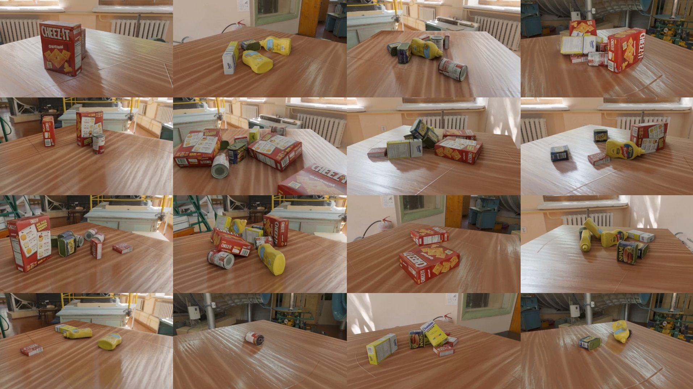

Remote-Operated Blender
-----------------------

Provides:
- Some convenient abstractions for setting up simple scenes
of textured meshes:
   - `blender_scripts/blender_scene_management.py` provides
   the highest-level abstractions, and builds (in a handful of
   places) on the other scripts in that folder (provided by
   Wei Gao, possibly adapted from elsewhere? not sure of their
   history yet). They can be invoked from Blender python scripts
   directly, presuming you have done the small amount of required
   Blender customization (see below). 
- A very simple ZMQ-based server for remotely operating that
highest-level abstraction. It provides a simple interface for
telling the Blender server to call any of those high-level
functions with arbitrary serializable arguments. It also has
a special command for getting an image back (currently a serialized
jpeg).
- A usage example for [Drake](github.com/RobotLocomotion/drake) (in the `drake_blender_visualizer` folder) that uses the Blender server to render images of a robot simulation scene. (This will eventually be moved out of this repo, but it's convenient to me to keep it here for now. :P)

## Setup

If on Linux, run:

    ./setup_bionic.py

It should create:
- Create a `./build/` directory
- Download and extract Blender
- Install necessary extra Python libraries in Blender
- Download assets for running examples
- Optionally download Drake (using `--with_drake`)
- Create `./build/setup.bash` that you should source for using this.

If on another system, you'll want to modify this, or make an alternative setup.

## Usage + Examples

### Basic examples

- Using the abstraction layer itself from Blender: launch `render_main_bsm.py` with Blender, using e.g. `run_example_bsh.sh`.
- Using the Blender server: launch the Blender server with blender, using e.g. `run_blender_server.sh`. Then run `test_blender_server.py` with any Python that has `zmq`, `numpy`, and `imageio`.	
- Using the lower-level utilities: launch `render_main_manual.py` with Blender, using e.g. `run_example_manual.sh`.

### Visualizing Drake robot simulations

If you want to play with the Drake robot simulation examples, you'll want both the above example assets, and also
possible example trajectory and bounding box detections files, which you can get
with the `drake_blender_visualizer/get_example_trajectory.sh` script. 

You can launch the YCB object simulation by using `run_blender_server.sh` in one terminal, and then running
`python demo_blender_visualizer_on_ycb_tabletop.py`. This will dump images in `/tmp/ycb_scene_%02/` folders.

You can launch the ManipulationStation teleop playback example with
`python demo_manipulation_station_with_bounding_boxes.py --log example_trajectory/teleop_log_manual_final.pickle --log_bbox example_trajectory/ycb_detections_full.yaml`.
This will dump images in the `/tmp/manipulation_station_ycb` folder. Some convenience scripts for rendering videos are provided in this directory.

## Schematic Flow for Rendering a Simple Scene

1) Client registers environment map with a filename attribute.
2) Client registers each material with identifying name and texture path(s) or
colors.
3) Client registers each object under a unique identifying name, with optional
parameters for location, quaternion rotation, material (by identifying name).
4) Client registers extra lights under unique names.
5) Client registers camera under a unique name with its focal length, fov, etc.

While True:

6) Client requests a frame from that camera's unique name.
7) Client updates camera location, object location, etc...

## TODOs / Ideas for neat features

### Immediate
- Make Docker system for launching the Blender server.
- Add option to the Blender server interface to start the Blender
server in a subprocess.
- Light management isn't exposed.
- Camera FOV, focal length, other parameters probably not exposed.
- Textures are reasonable reusable between objects, I think, but objects
themselves are reloaded pretty liberally. Can I fix that?
- Images get saved out to disk + then reloaded for serialization back
to the client. This is really inefficient (hundreds of ms for big ones).
Getting images directly from Blender in background mode is tricky, though --
the standard trick of rigging up a Viewer node and grabbing its pixels only
works if Blender is *not* in background mode.

### Nice-to-have
- Manage different scenes simultaneously.
- Manage entities in frame trees rather than individual objects in maximal coords.
